# **Navi Home Client**
> The client application for the [Navi Home Server - Intelligent Smart Home](https://github.com/enhancer13/navi-home)
> 
> The application is written in **React Native** using **TypeScript**
> 
&nbsp;&nbsp

## Project Status
#### Build Status:

#### Code Quality Metrics

#### Test Coverage Metrics

## Project Description
**Navi Home** takes home automation to the next level by integrating AI, IP-cameras, and IoT devices under a single umbrella. It's more than just a smart home; it's a self-aware ecosystem that can see, communicate, and make decisions based on the configured automation scenes.

---
> 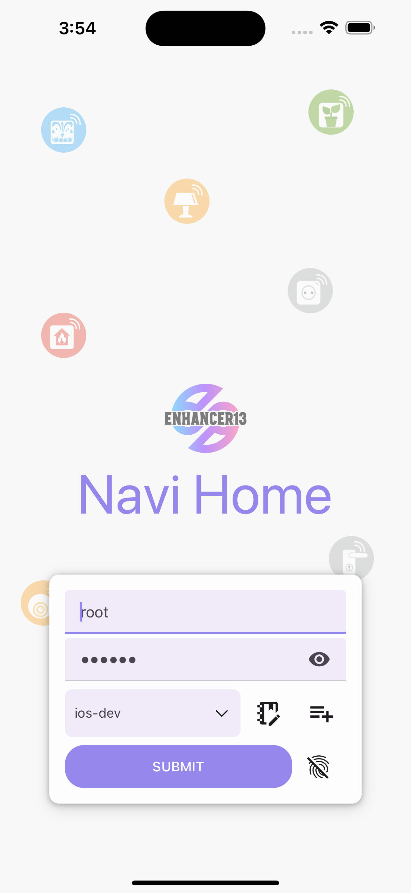
> 
> 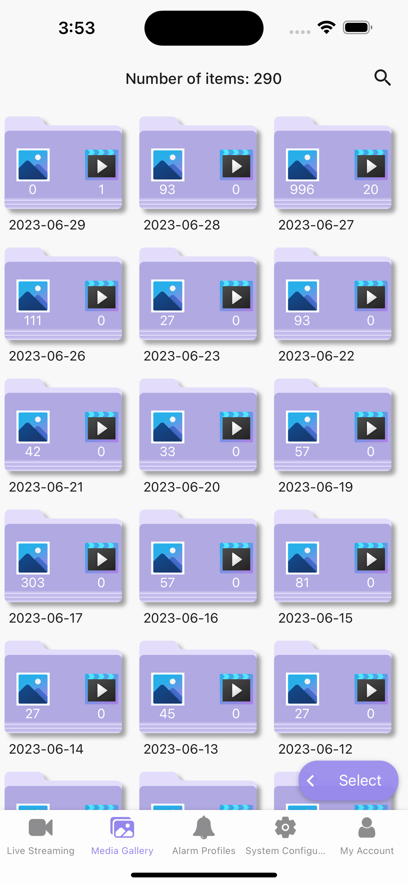
> 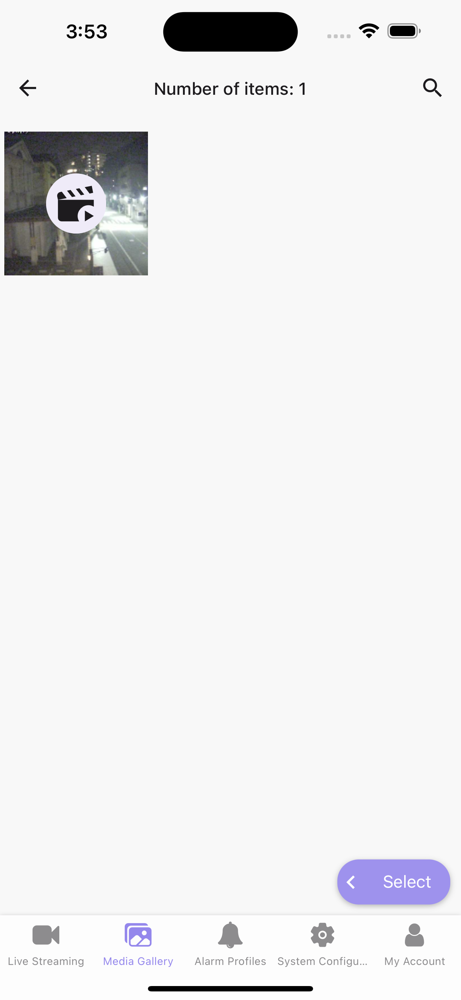
> 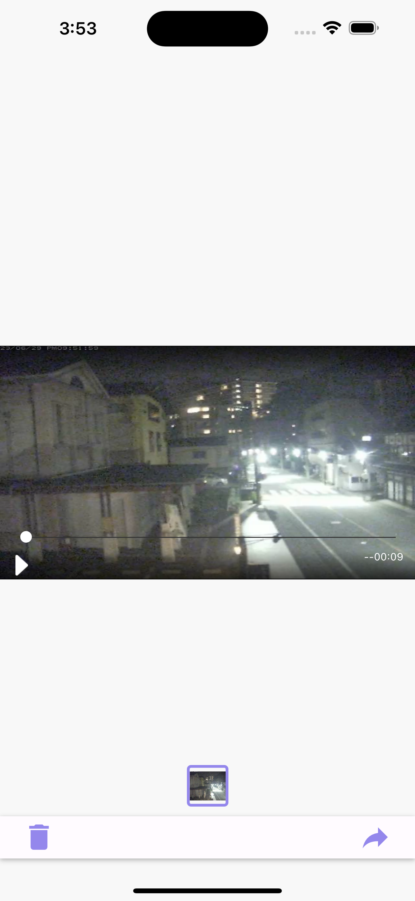
> 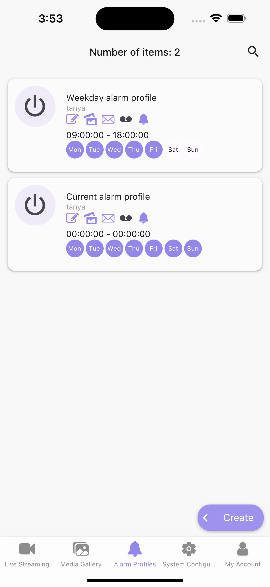
> 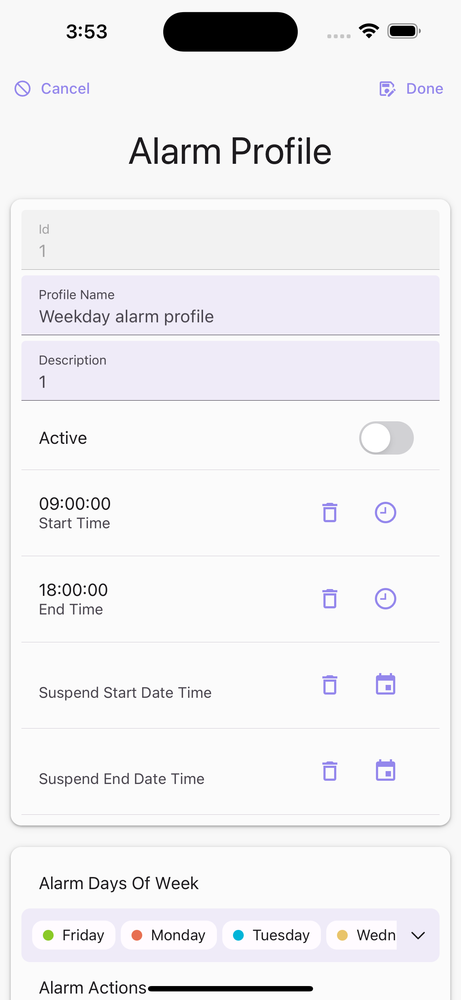
> 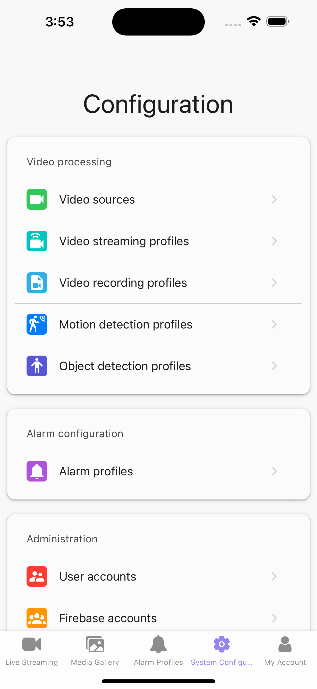
> 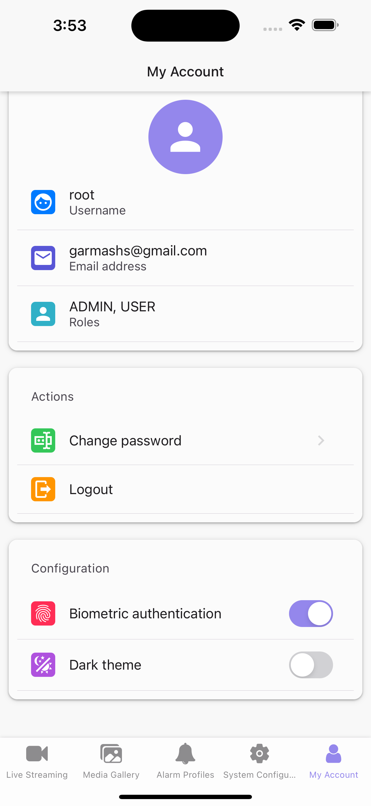
---
> 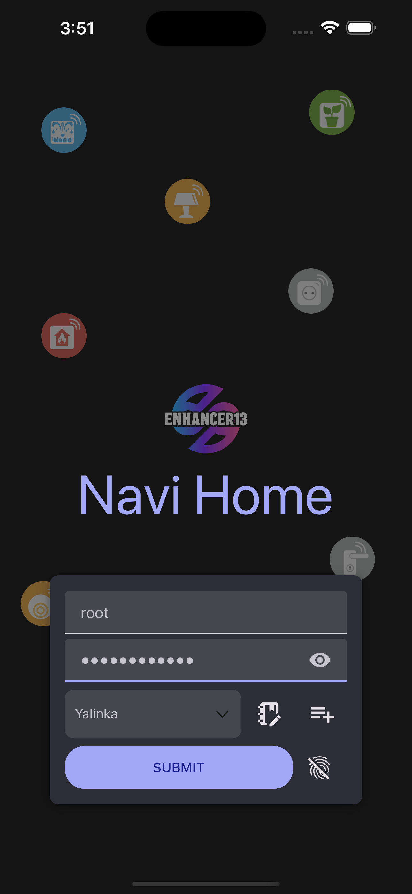
> 
> 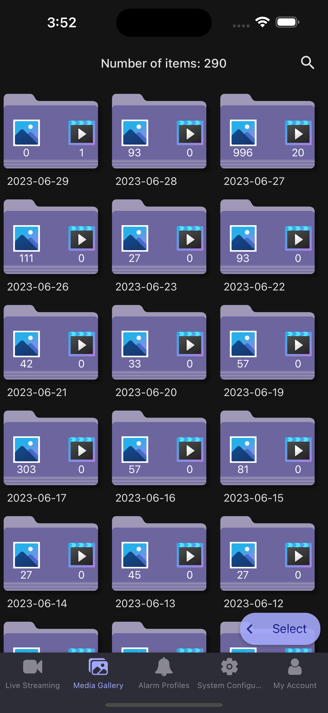
> 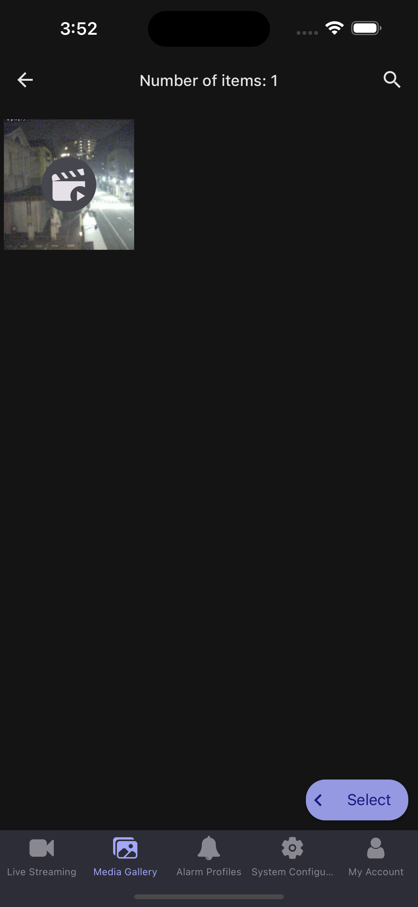
> 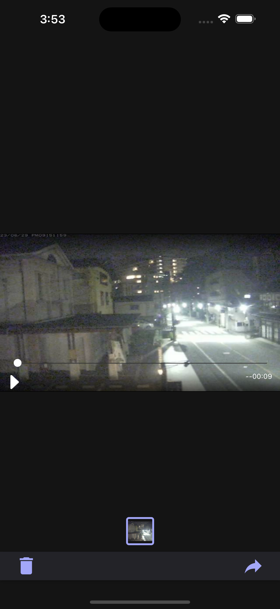
> 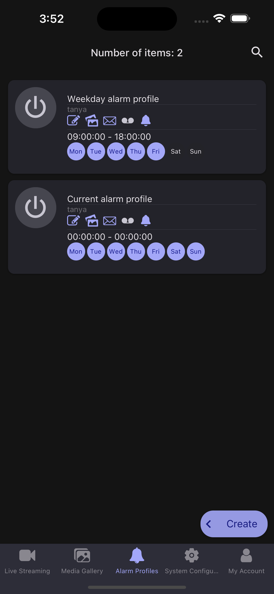
> 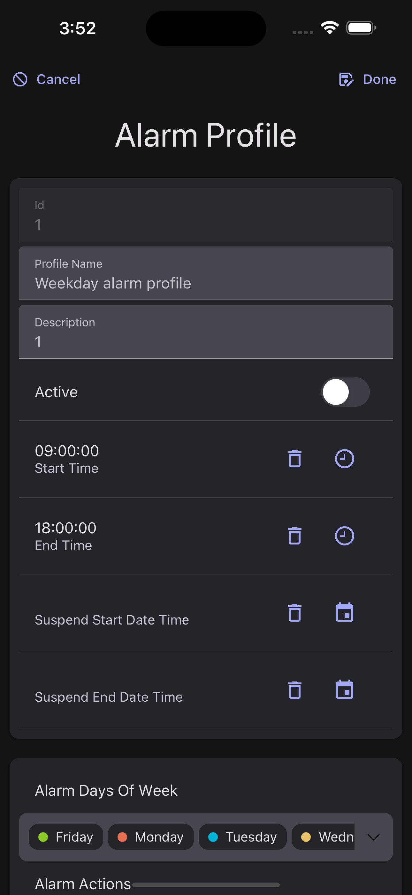
> 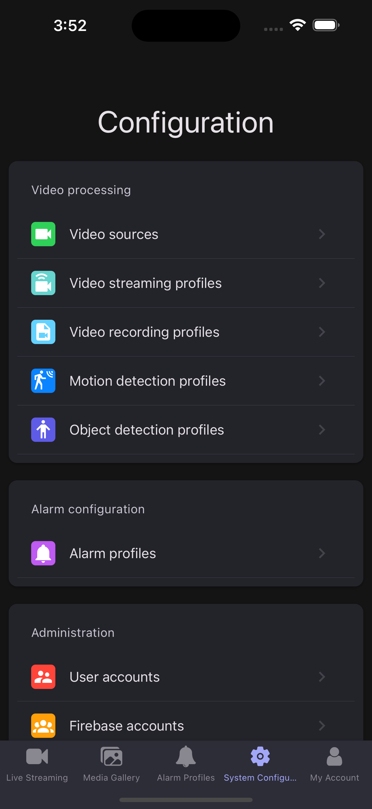
> 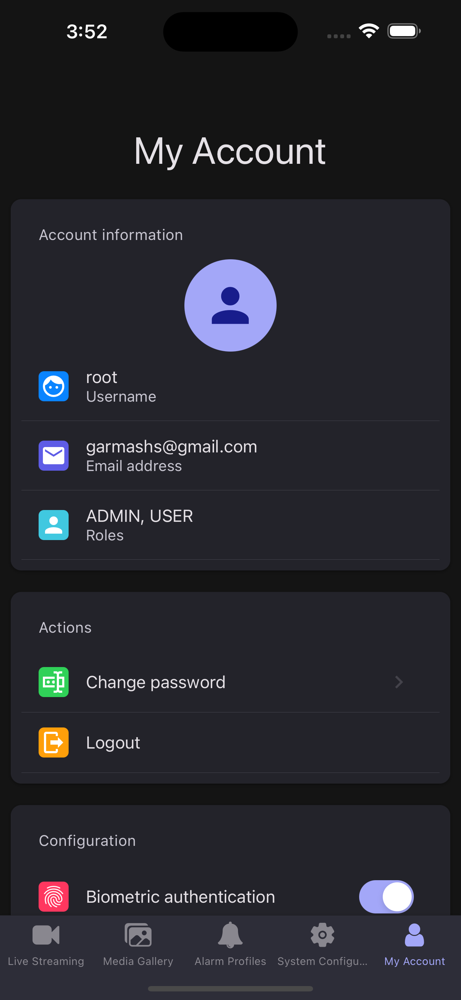
---

  
Unified Interface

 
It is possible to seamlessly integrate any **IP camera** and a plethora of **IoT devices** (IoT devices support will be released in version 2.0.0). Monitor and manage all of these devices using a single application, thereby breaking the silos of separate device interfaces.

---
><h3>Unified Video Stream Manager</h3>
>Manage all your configured video feeds in one place. This feature allows you to play videos, initiate recording, capture screenshots, and more, all from a single, convenient screen.
>
>
---
><h3>Simplified Setup Interface</h3>
>Set up streaming from any publicly available video source in just a few simple steps through the intuitive configuration screen.
>
>

 

  
Adaptive Alarm System

 
The alarm system in Navi Server can adapt to different profiles, each with its own set of actions such as push notifications, emails, mobile phone calls, image or video saving. It can utilize either a motion detector or the AI engine's person detection feature (AI engine's person detection support will be released in version 1.3.0).

---
><h3>Comprehensive Alarm Settings</h3>
>Alarm system offers extensive configuration options for a tailored experience. Choose from a range of options including time frames, days of the week, notification targets (such as emails, push notifications, video recordings, etc.), user groups, and more. Plus, the ability to suspend notifications adds another layer of customization to meet your unique needs.
>
>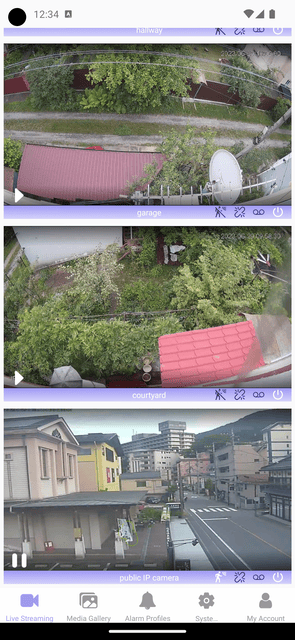
---
><h3>Showcase of Alarm System Capabilities</h3>
>This demonstration highlights the functionalities of the alarm system, encapsulating its ability to detect movement and alert the specified user through in-app notifications.
>
>

 

  
Media Gallery

 
Store and access images or videos recorded by Navi Server in the media gallery. These media items, created automatically by alarm profiles, automation scenarios or manually triggered, can be shared or used to further train the AI engine (will be released in version 1.3.0) for more precise detection.

---
><h3>Showcase of Media Gallery Features</h3>
>The Media Gallery serves as a repository for images and videos generated through alarm profiles, automated scenarios, or user-triggered events.
>
>
---
>The Media Gallery allows not ony to view the media items, but also to share them with others, delete them, or use them to train the AI engine (will be released in version 1.3.0).
>
>

 

  
Event-Driven Automation

 
Leverage the power of event-driven programming within your home automation. Navi Server allows for intricate conditional scenarios such as "When any person enters the living room, then the light turns on automatically" or "When all the persons have left the house, then the system automatically engages security mode." These scenes can be manually configured, offering extensive flexibility and customizability.

---
>**<u>Available from Version 1.2.0</u>**

 

  
AI-Powered Object Detection

 
Armed with an AI engine, Navi Server can detect any person in your house and reflect their position on an interactive house map. This brings a new dimension to home monitoring, safety, and automation.

---
>**<u>Available from Version 1.8.0</u>**

 

  
Biometric Authentication

 
The application streamlines the login process by incorporating biometric authentication mechanisms. On Android devices, the application supports fingerprint scanning, while on iOS devices, it utilizes FaceID for secure and convenient access.

---
><h3>Demonstration of Biometric Authentication on Android</h3>
>This demonstration presents the process of fingerprint-based authentication for Android devices.
>
>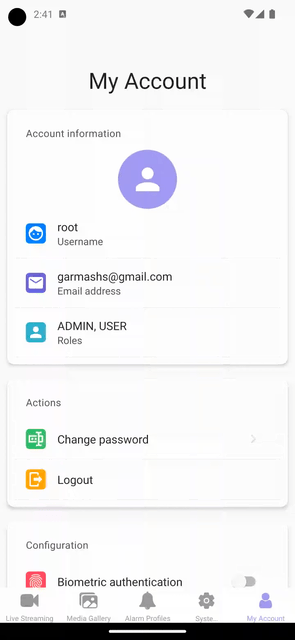

 

  
Theming Support

 
By default, application matches your operating system's theme upon installation, providing a familiar and intuitive visual experience. Later, if you prefer, you can manually switch between light and dark themes according to your preference.

---
><h3>Showcasing the Theme Switching Feature</h3>
>
>

## Installation
The application operates in conjunction with a backend server, the [Navi Home Server - Intelligent Smart Home](https://github.com/enhancer13/navi-home), which is distributed independently.

The server is currently under development and its release is on the horizon. Should you wish to participate in testing the beta version, don't hesitate to [reach out to me](mailto:garmashs@gmail).

>Under development and will be available soon.

## Roadmap & Vision
### 1.0.0:
- [x] Add basic interface for integration with [Navi Home Server - Intelligent Smart Home](https://github.com/enhancer13/navi-home)
    - [x] User screens:
      - [x] Login
      - [x] Server config
      - [x] Video streaming
      - [x] Media gallery
        - [x] Single media viewer
          - [x] Slide, zoom, and pan
          - [x] Share media
          - [x] Delete media
      - [x] Alarm profiles
      - [x] System configuration
        - [x] Video sources
        - [x] Video streaming profiles
        - [x] Video recording profiles
        - [x] Motion detection profiles
        - [x] Object detection profiles
        - [x] Alarm profiles
        - [x] User accounts
        - [x] Firebase accounts
      - [x] My account
        - [x] Change password
    - [x] Support for biometric authentication
    - [x] Support for theming
    - [x] Support for CRUD operations on all entities
    - [x] Firebase integration (cloud messaging including push notifications and data messaging)
    - [x] Support for in-app notifications
### 1.1.0: 
- [ ] Add support for WebRTC based video streaming viewer, for low latency video playback
### 1.2.0:
- [ ] New user screens
    - [ ] Automation scenes (predefined scenarios)
    - [ ] Automation scenarios (user defined)
    - [ ] User notifications viewer
      - [ ] Filter notifications by type, date, and status etc.
      - [ ] Mark notifications as read
      - [ ] Delete notifications
      - [ ] Show notification details (link to the source)
### 1.3.0:
- [ ] Integration with AI backend engine
  - [ ] New user screens
    - [ ] Object detection
    - [ ] AI engine training
### 2.0.0:
- [ ] New user screens
  - [ ] Dashboards (main user screen - manage all aspects of the system)
  - [ ] IoT configuration
### 2.1.0:
- [ ] New user screens
    - [ ] Configure alarm zones
### 3.0.0:
- [ ] New user screens
  - [ ] Interactive home map creator
  - [ ] Interactive home map viewer
### 3.1.0:
- [ ] Add localization for other languages
    - [ ] Ukrainian
  
## Licence
This repository is licensed under the terms of the [**MIT license**](LICENSE).

## Contributors
Contributions of any kind are welcome!

## Contact and Suggestion
Any feedback is welcome - feel free to create an issue or email me - [garmashs@gmail.com](mailto:garmashs@gmail). Thank you :blush:

## Support and Donation 🕊️
If you like my work, you can support me by donation. 👍
